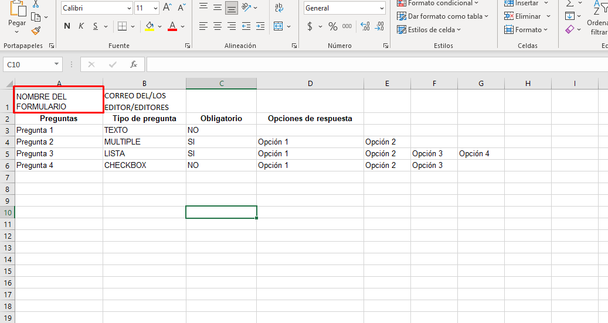
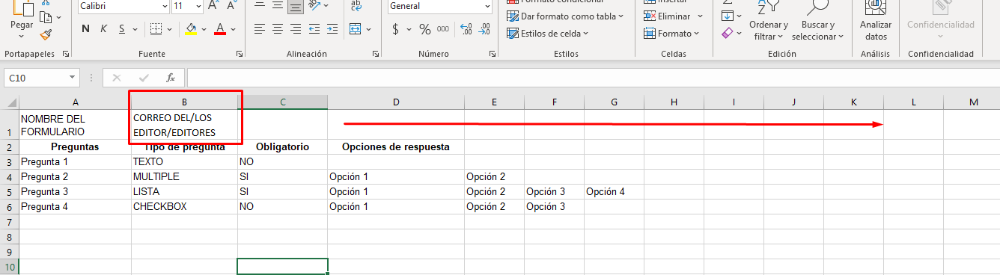
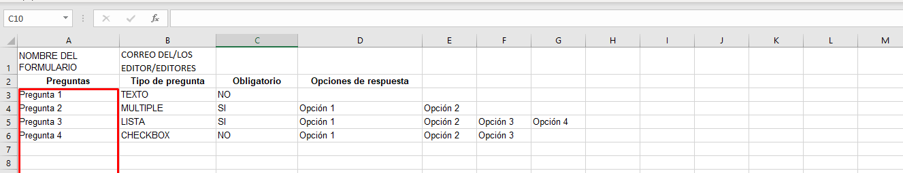
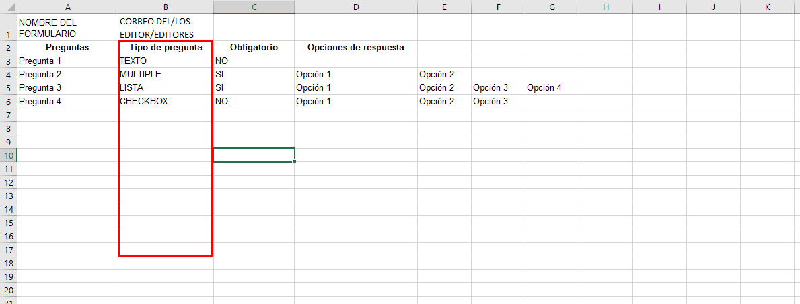
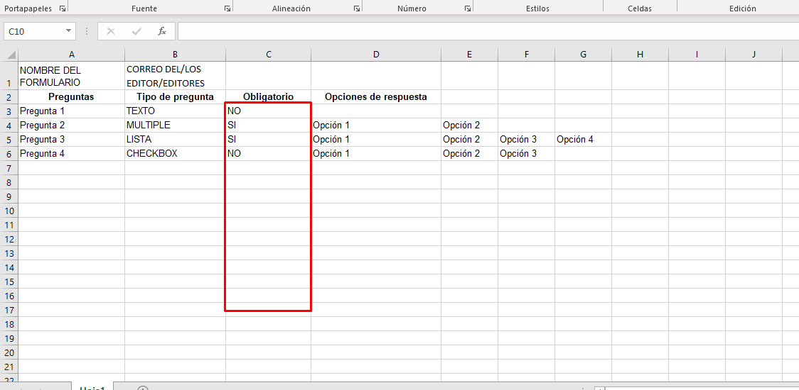
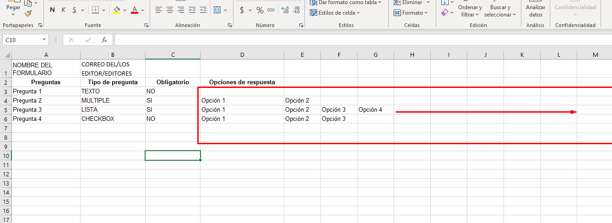

# Crear formulario de Google a partir de un Excel.

_Subimos el archivo XLS o XLSX a google Drive de la cual lo convierte a un formato de google Sheets. De lo cual con GS(Google Script) se genera el formulario y muestra la URL del formulario creado. Para ello debemos seguir las reglas que debe contener el excel para su creación correctamente._

### Pre-requisitos 📋

* Cuenta de google
* Descargar la plantilla de [Drive](https://drive.google.com/file/d/1kPHLfkWEpo-YPiOKvckquIPhyDrVPhl8/view?usp=sharing)

### Explicación de la plantilla 📌
La plantilla es un archivo en excel el cual debe estar correctamente ordenado para poder crear el formulario sin ningún error. Es por ello que aquí explico paso por paso como llenarla, además una cosa muy importante es no cambiarle el nombre la hoja de la plantilla ya que con esa lo identifica la hoja que contiene los datos para el formulario.


* _En la posición fila 1, columna 1 se ingresará el titulo que llevará el formulario_



* _Para poder agregar editores del formulario, se deberá ingresar su correo electronico a partir de la fila 1, columna 2. Se deberá ingresar el correo en cada celda, desde la celda B1 hacía la derecha que sería C1, D1 y así sucesivamente._
> (Recuerda sólo incluir correos de Google)



* _En la primera columna, a partir de la fila 3 se insertarán los titulos de todas las preguntas que llevará el formulario_



* _En la segunda columna, a partir de la fila 3 se insertará el tipo de pregunta que aparecerá en el formulario_
> (RESPETAR SOLO ESCRIBIR EN MAYÚSCULAS PARA QUE SEA RECONOCIDO)



Hay por el momento 4 tipos de preguntas: TEXTO, MULTIPLE, LISTA Y CHECKBOX. Se describen a continuación:

```
 TEXTO: permite al encuestado ingresar una sola línea de texto.

```

```
 MULTIPLE: permite al encuestado seleccionar una opción de una lista de botones de varias opciones.

```

```
 LISTA: permite al encuestado seleccionar una opción de una lista desplegable. 

```

```
 CHECKBOX: permite al encuestado seleccionar una o más casillas de verificación.

```

```
 FECHA: permite al encuestado indicar una fecha.

```

```
 TIEMPO: permite al encuestado indicar un período de tiempo.

```

```
 FECHA/TIEMPO: permite al encuestado indicar una fecha y hora.

```

```
 PARRAFO: permite al encuestado ingresar un bloque de texto.

```

```
 SECUENCIA:  pregunta que permite al encuestado elegir una opción de una secuencia numerada de botones de opción. El Pprimer elemento debe ser 1. El límite superior 
 debe estar entre 3 y 10

```


* _En la tercera columna, a partir de la fila 3 se colocorá SI o NO para especificar si la pregunta es de carácter obligatorio o no._
> (RESPETAR SOLO ESCRIBIR EN MAYÚSCULAS PARA QUE SEA RECONOCIDO)



*_En la cuarta columna, a partir de la fila 3 se colocarán todas las respuestas de cada pregunta, cada respuesta deberá ir en una celda así hacía la derecha como lo especificado en los correos de los editores_
> (LOS TIPOS TEXTOS DEBERÁN IR VACIOS YA QUE EL ENCUESTADO INGRESA DE FORMA MANUAL LA RESPUESTA)




### Instalación 🔧

_1.- Ir a la plataforma de google de [Script](https://script.google.com) y le damos en Start Scripting e iniciamos sesion con la
cuenta de Google sino hemos iniciado_

_2.- Dar clic en Nuevo proyecto y si te aparece del lado derecho un boton con la leyenda "Usar el editor antiguo", darle clic ahí_

_3.- Vamos a desactivar la tecnologia de Chrome V8 ya que con ella sube los archivos a Drive rotos,
 para ellos vamos al menu Ejecutar>Inhabilitar el nuevo tiempo de ejecución de Apps Script con tecnología de Chrome V8_
 
_4.- Tendremos que habilitar los servicios avanzados de google. Vamos al menu Recursos>Servicios avanzados de Google y te 
pedirá aceptar las Condiciones de servicio de Cloud Console, damos clic y las aceptamos_

_5.- Copiamos todo el código de [CrearFormulario](https://github.com/hamdelg11/CrearFormularios/blob/main/CrearFormulario.gs) y lo
sustituimos por el código creado en automático de myFuction()_

_6.- Creamos un archivo HTML, vamos al menu Archivo>Nuevo>Archivo HTML y sustituimos el código creado en automático por
[index GAS](https://github.com/hamdelg11/CrearFormularios/blob/main/index%20GAS.html)_

_7.- Ya solo faltaría imprementarlo como aplicación web. Vamos ahora al menu Publicar>Implementar como aplicación web
en la sección Who has access to the app escogemos a nuestra preferencia quien pueda acceder a ella, damos clic en deploy
y nos arrojará el link a nuestra aplicación web._
